# Agentic-ML-Orchestration-Engine-for-Autonomous-Pipelines

A fully autonomous Machine Learning platform. The LLM agent analyzes your dataset, reasons about strategy, selects models, tunes hyperparameters, reflects on results, and explains everything in plain English.

## 🤖 Agentic Features (NEW)

| Feature                    | Description                                                                      |
| -------------------------- | -------------------------------------------------------------------------------- |
| **Smart Dataset Analysis** | Claude profiles your data: shape, missingness, skewness, imbalance, correlations |
| **LLM Strategy Planning**  | Agent reasons about and selects models, preprocessing, HPO trial count, metric   |
| **Adaptive Reflection**    | After training, agent reviews results and can trigger a second training pass     |
| **Plain-English Insights** | Executive summary, key findings, risks, and next steps — no ML jargon            |
| **AI Chat**                | Ask the agent anything about your data, model, or results                        |
| **Streaming Reasoning**    | Watch Claude think in real time during planning                                  |
| **Rule-Based Fallback**    | Works without an API key using intelligent heuristics                            |

## 🚀 Quick Start

```bash
pip install -r requirements.txt
python run.py
# Open http://localhost:8000
```

## ⚙️ Enable LLM Agent

1. Get an Anthropic API key from [console.anthropic.com](https://console.anthropic.com)
2. Go to **🤖 Agent → ⚙ Agent Settings** in the UI
3. Paste your key and click **Save Config**
4. Use **🤖 Agent Train** instead of New Experiment

## 📁 Project Structure

```
automl_v6/
├── api/main.py              # FastAPI backend + agentic endpoints
├── automl/
│   ├── agent.py             # Core AutoML pipeline orchestrator
│   ├── llm_agent.py         # 🆕 LLM brain — Claude tool calling & reasoning
│   ├── trainer.py           # Model training + Optuna HPO
│   ├── preprocessor.py      # 12 preprocessing strategies
│   ├── data_handler.py      # EDA engine + dataset loading
│   └── explainability.py    # SHAP + LIME
├── frontend/index.html      # Full SaaS UI (no build step)
└── requirements.txt
```

## 🏗️ Architecture

```
User Upload
    ↓
LLM Agent Brain (Claude claude-sonnet-4-5)
    ├── profile_dataset()        ← compact feature analysis
    ├── plan()                   ← tool call: set_training_plan
    │     └── chooses models, trials, preprocessing, metric
    ├── AutoMLAgent.run()        ← executes the plan
    ├── reflect()                ← tool call: request_more_training
    └── generate_insights()     ← tool call: generate_final_insights
```

## 📸 Screenshots

### 🤖 Agentic AutoML Dashboard

Main interface for autonomous ML workflow execution and agent interaction.

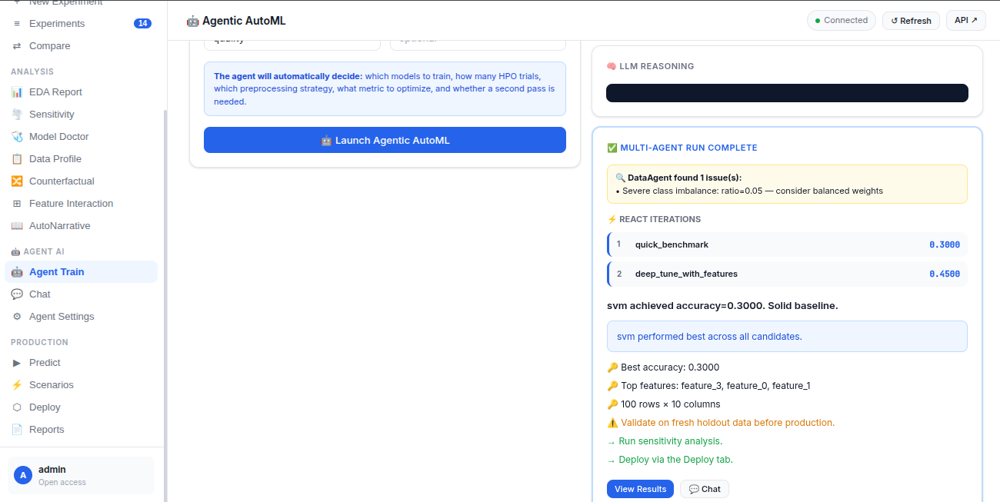

---

### 🧠 Agentic Training Interface

LLM-powered orchestration dashboard for intelligent pipeline planning and execution.

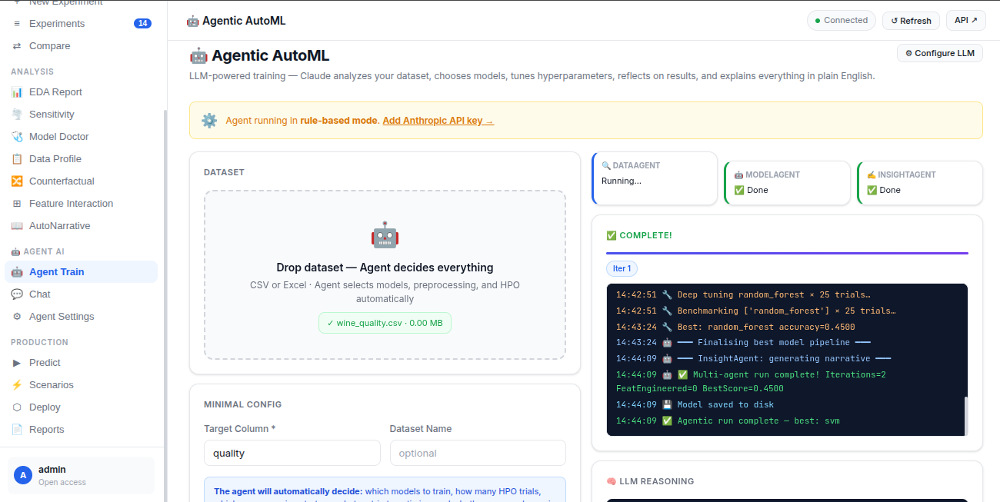

---

### 📊 EDA Dashboard

Interactive exploratory data analysis dashboard with automated visual insights.

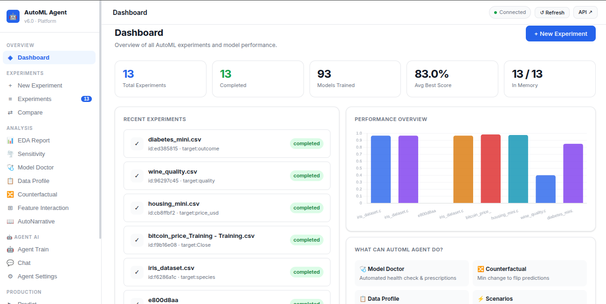

---

### 📑 Automated EDA Reports

Generated statistical reports and feature-level analysis.

#### Report 1

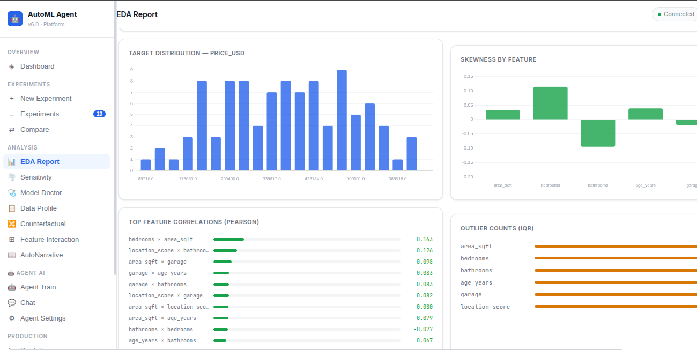

#### Report 2

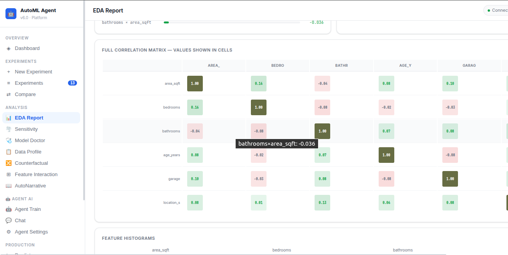

#### Report 3

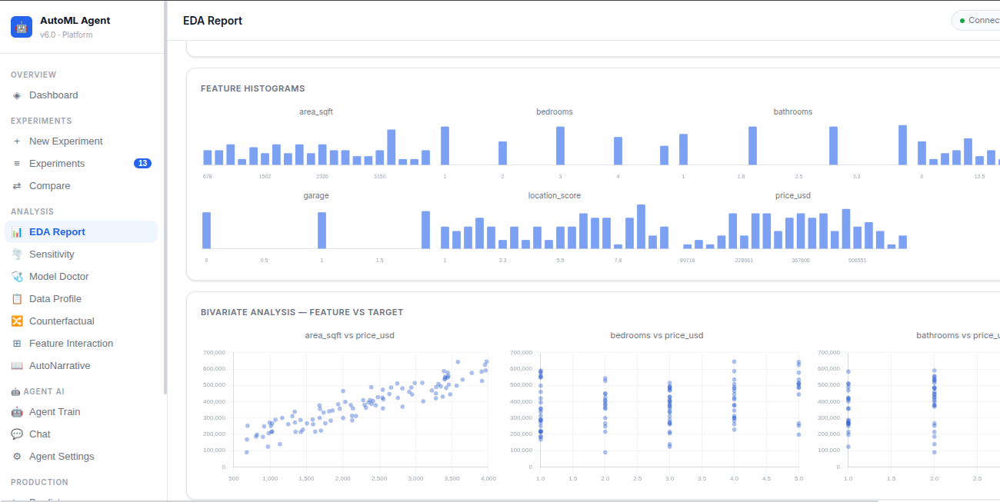

---

### 🧾 Dataset Profiling

Automated profiling for missing values, distributions, imbalance, and correlations.

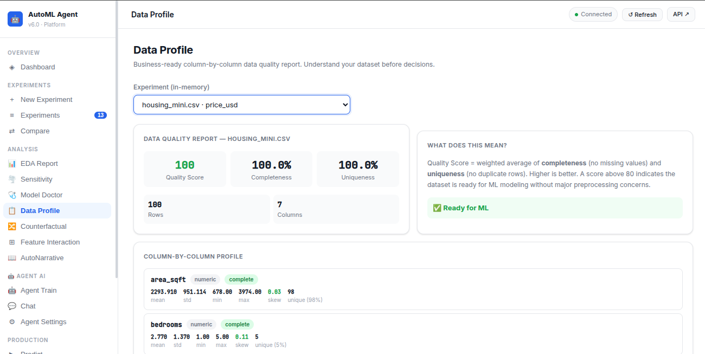

---

### 📈 Model Metrics Comparison

Performance comparison across multiple ML models and evaluation metrics.


---

### 🩺 Model Doctor Analysis

Detailed diagnostics and model health evaluation dashboard.

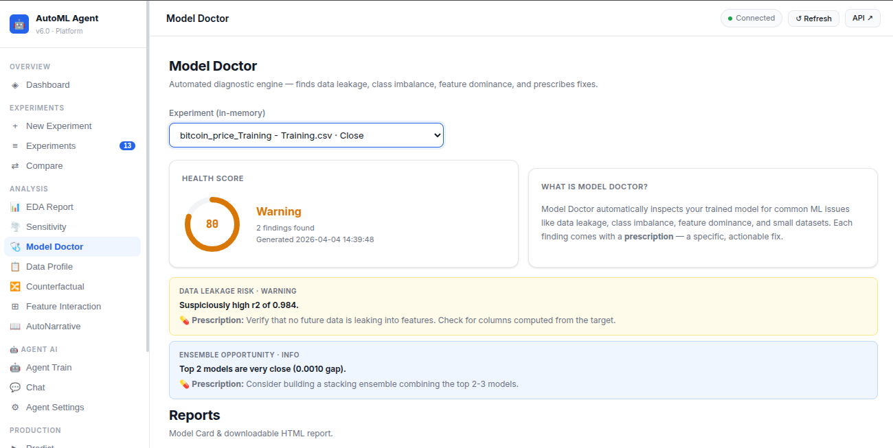

---

### 🎯 Counterfactual Explanations

AI-generated counterfactual analysis for interpretability and decision insights.

#### Counterfactual Analysis 1

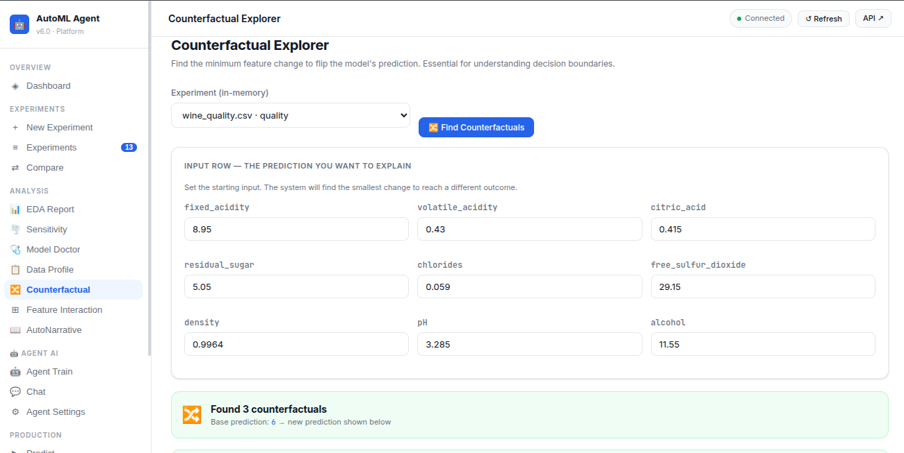

#### Counterfactual Analysis 2

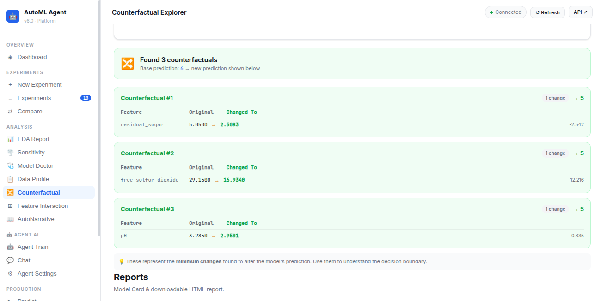

---

### 🧪 Experiment Tracking

Track experiments, configurations, and training outcomes across runs.

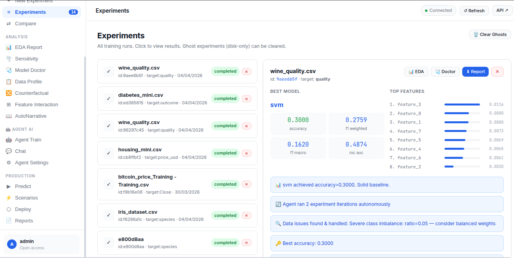

---

### 📉 Sensitivity Analysis

Feature sensitivity analysis for understanding model robustness and behavior.

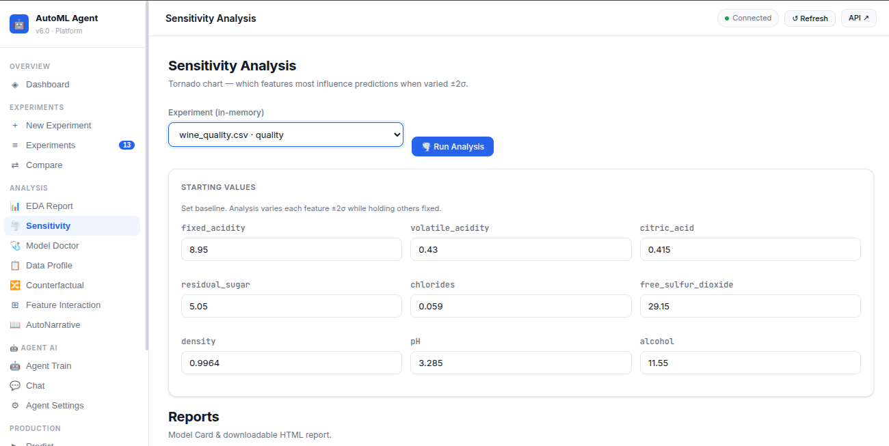

---

## 🧰 All Features

**Analysis:** EDA Report · Sensitivity · Model Doctor · Data Profile · Counterfactual · Feature Interaction · AutoNarrative

**Production:** Predict · Batch CSV · Scenario Analysis · Deploy (Local/Docker/HuggingFace) · Reports

**Agent:** Agentic Train · AI Chat · Stream Reasoning · Agent Insights

## API

```
POST /agent/train              # Fully agentic training
GET  /agent/config             # Get LLM config
POST /agent/config             # Set API key + model
POST /agent/test-key           # Verify Anthropic key
POST /agent/chat               # Q&A about experiments
GET  /agent/chat/stream        # SSE streaming chat
POST /agent/stream-plan        # SSE streaming reasoning
GET  /experiments/{id}/agent-analyze  # LLM analysis of existing experiment
```
